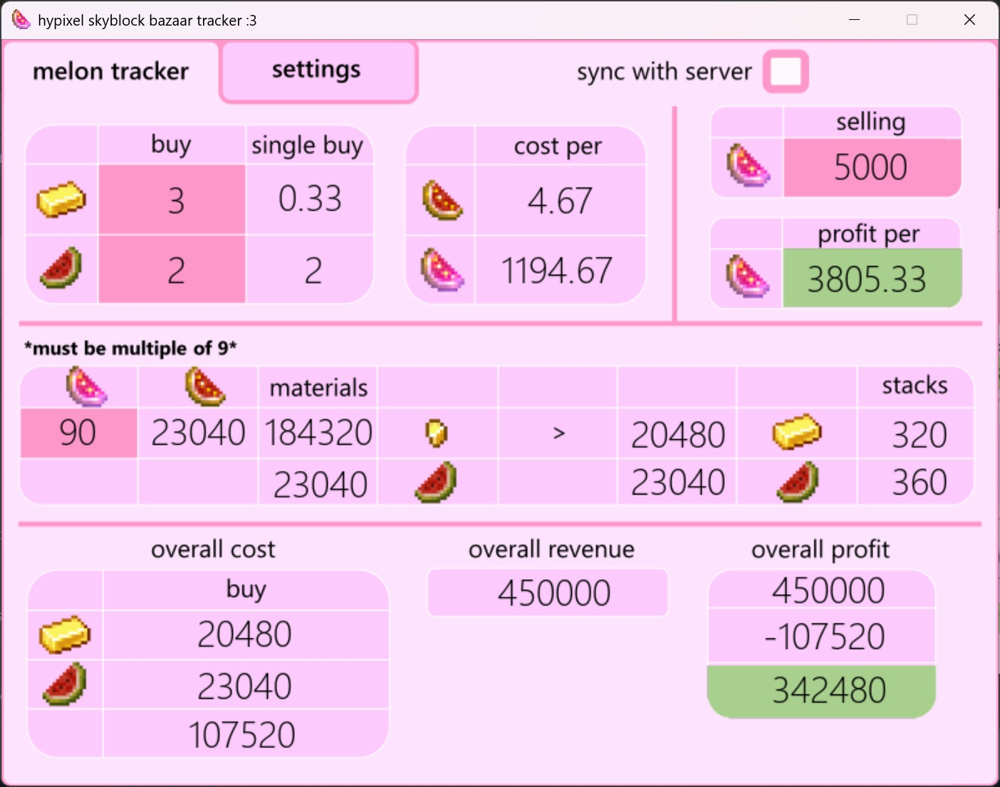

# Hypixel Bazaar Melon Tracker

This application tracks (every minute) the current buy and sell prices related to melons on the Skyblock minigame on the Hypixel server in Minecraft. It aims to tell you whether or not the "melon method" is profitable at the moment as well as monitoring profits with custom inputs.

## Requirements

Install python on your computer:
https://www.python.org/downloads/

Use the package manager [pip](https://pip.pypa.io/en/stable/) to install pygame and beautifulsoup.

```bash
pip install pygame
```

```bash
pip install requests beautifulsoup4
```

## Features
- Customiseable Theme
- Resizeable
- Icons/text toggle
- Buy and sell prices update every 1 minute
- Autosave
- Custom artwork

## How to use
- Head over to settings tab at the top to customise theme, sizing and display types.
- Toggle on the sync if you want to fetch the live buy and sell values
- Modify the amount of output (enchanted glistening melons) you want to make
- Turn off sync if you want to manually modify everything
- There are 4 editable sections:
    - gold price
    - melon price
    - enchanted glistening melon selling price
    - amount of product to produce

## File Layout
```
📦project
 ┣ 📂pics           <- holds backgrounds, sprites, and overlays
 ┣ 📂screenshots    <- holds screenshots for the readme file
 ┣ 📜main.pyw       <- the main python file running the tool
 ┣ 🧾data.txt       <- holds buy, sell and quantity data
 ┣ 🧾settings.txt   <- holds settings data
 ┗📙readme.md       <- this file describes everything that the game does
```

## Screenshots




